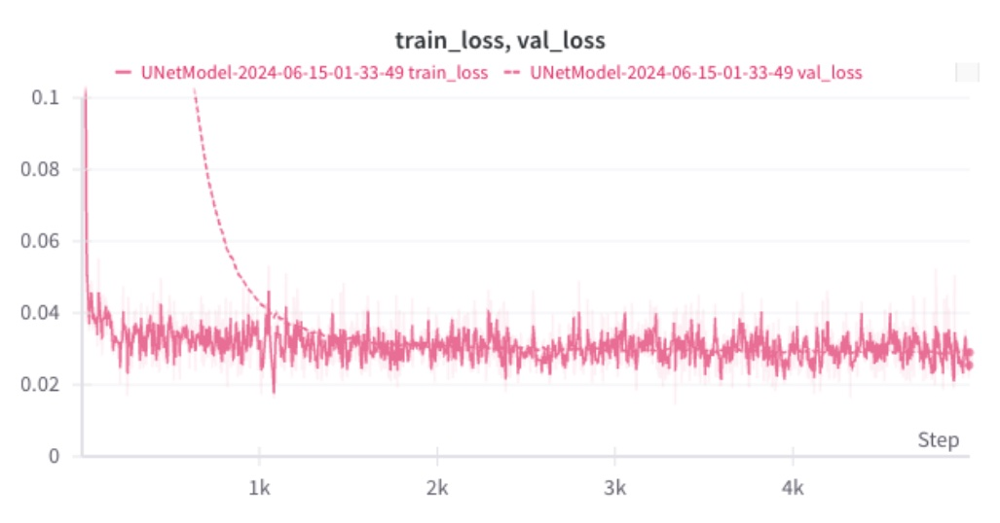

# Implementation of the original diffusion paper on the CIFAR10 dataset

Paper: https://arxiv.org/abs/2006.11239


## Setup

- Create a conda environment with the following command:

```bash
conda env create -f environment.yml python=3.10
```


- Download the CIFAR10 dataset using the [notebooks/download-and-explore-dataset.ipynb](notebooks/download-and-explore-dataset.ipynb). 

- Set the env in [diffusion/environments/environments.py](diffusion/environments/environments.py), which should look something like this

```text
DATA_DIR="/home/viktor/Documents/diffusion/data" # where you'll store the cifar10 dataset
DATA_DUMPS_DIR = "/opt/diffusion/data_dumps" # where you'll store the processed data
MODEL_OUT_DIR=f"{DATA_DUMPS_DIR}/models" # where you'll store the trained models
```

- 


# Train


To train a CIFAR10 model, run the following command:
```bash
python tools/train.py
```


Here's the train/val curves



# Sample images

Once you have the model trained, you can generate samples using the following command:

```bash
python tools/sample.py --experiment_name <experiment_name> --num_timesteps 1000
```
to get the experiment nam. You can check the `MODEL_OUT_DIR` directory, which should have the experiment name as a subdirectory. If you enabled the wandb, just copy the experiment name from the wandb dashboard.


# Visualization


<p align="center">
  
</p>
